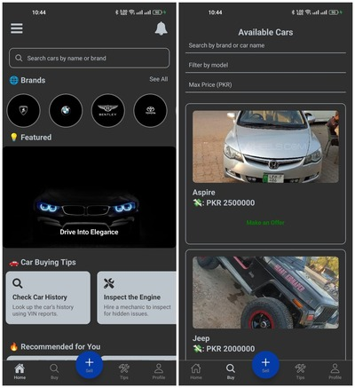

🚘 PakCruze – Car Buying & Selling App
PakCruze is a sleek and simple mobile application that lets users buy, sell, and browse cars across Pakistan. Built with React Native (Expo) and integrated with Firebase Authentication, Firestore, and Cloudinary, it provides an end-to-end car marketplace experience — right from your phone.

🔥 Key Features
🔐 User Authentication using Firebase (Email/Password)

🚗 Upload Car Listings with:

Car name, brand, model, number, owner name

Description and price demand

Image upload via Cloudinary

📷 Image Picker from gallery only (Expo Image Picker)

📜 Car List View with delete and sold status functionality

💬 Make an Offer button that shows seller's contact

🔎 Search & Filter cars by brand, model, price, or name

🎞️ Image Carousel, animated splash screen (Lottie)

🔧 Maintenance Tips & Promotions section

👤 User Profile tab

🧭 Navigation Stack with Bottom Tabs and Drawer

📦 APK file included in releases for easy testing

📱 Built With
React Native (Expo Go)

Firebase (Auth + Firestore)

Cloudinary (Image Hosting)

React Navigation

Lottie Animations

React Native Reanimated Carousel

